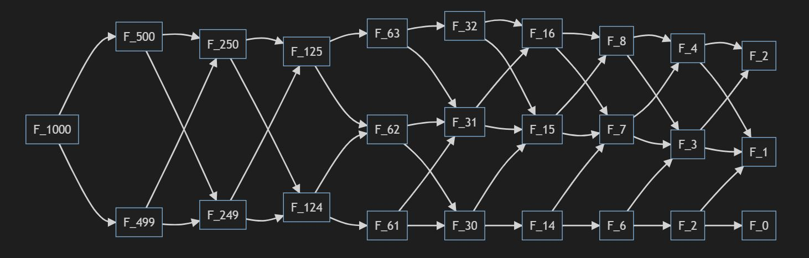

# 斐波那契多项式(Fibonacci Polynomials)

上一篇讲了 斐波那契数列，本篇讲 斐波那契函数。

更多精彩内容可以参见 [Ron Knott 博士的多媒体网站][RonKnott]

## Dijkstra 递归算法求全部 Fibonacci 数

1978年，Edsgar W Dijkstra 教授在文中描述了 Fibonacci的[Dijkstra算法][Dijkstra]。

$\begin{cases}
    f(2n-1) = f(n-1)^2 + f(n)^2 & (1)  \\
    f(2n)  = [2f(n-1)+f(n)]f(n) & (2)
\end{cases}$  

上述算法的时间复杂性为 $o(\log{n})$，推荐该算法，测试到 `50000` 都没有问题。

举例：计算$f(1000),$ 只需要计算 $f(500), f(499),$ 依次类推，结果如下：

<!--不支持mermaid时，用图片  -->

:::mermaid
graph LR
    O1[F_1000]-->A1
    O1-->A2
    A1[F_500]-->B1[F_250]
    A1-->B2
    A2-->B1
    A2[F_499]-->B2[F_249]
    B1-->C1[F_125]
    B1-->C2[F_124]
    B2-->C1
    B2-->C2
    C1-->D1[F_63]
    C1-->D2[F_62]
    C2-->D2
    C2-->D3[F_61]
    D1-->E1[F_32]-->F1[F_16]-->G1[F_8]-->H1[F_4]-->J1[F_2]
    D1-->E2[F_31]-->F1
    D2-->E2
    D2-->E3[F_30]-->F2[F_15]-->G1-->H2[F_3]-->J1
    D3-->E2
    D3-->E3
    E1-->F2
    E2-->F2
    E3-->F3[F_14]-->G2[F_7]-->H1
    F1-->G2
    F2-->G2
    F3-->G3[F_6]-->H2
    G2-->H2
    G3-->H3[F_2]-->J2[F_1]
    H1-->J2
    H2-->J2
    H3-->J3[F_0]
:::

算法实现参见[liuxiang0's github for fibo_dijkstra][fibo_Dijkstra_src]

## 函数定义始于多项式递归定义

定义(Definition):  
$(1)\; f(0, z) = 0, f(1, z) = 1,$  
$(2)\; f(n, z) = z*f(n-1, z) + f(n-2, z);$  
$\forall n > 1, n \in \mathbb{N}^+, f(n, 1) = F_n, z\in \mathbb{C}$.

写全了就是如下的序列：

$f(0,z) = 0$  
$f(1,z) = 1$  
$f(2,z) = z$  
$f(3,z) = z^{2} + 1$  
$f(4,z) = z^{3} + 2 z$  
$f(5,z) = z^{4} + 3 z^{2} + 1$  
$f(6,z) = z^{5} + 4 z^{3} + 3 z$  
$f(7,z) = z^{6} + 5 z^{4} + 6 z^{2} + 1$  
$f(8,z) = z^{7} + 6 z^{5} + 10 z^{3} + 4 z$  
$f(9,z) = z^{8} + 7 z^{6} + 15 z^{4} + 10 z^{2} + 1$  
$f(10,z) = z^{9} + 8 z^{7} + 21 z^{5} + 20 z^{3} + 5 z$  
......

~~~python
>>> from sympy import fibonacci, latex
>>> from sympy.abc import z
>>> fibz=[fibonacci(n,z) if n else 0 for n in range(11)]
>>> fibz
[0, 1, z, z**2 + 1, z**3 + 2*z, z**4 + 3*z**2 + 1, z**5 + 4*z**3 + 3*z, z**6 + 5*z**4 + 6*z**2 + 1, z**7 + 6*z**5 + 10*z**3 + 4*z, z**8 + 7*z**6 + 15*z**4 + 10*z**2 + 1, z**9 + 8*z**7 + 21*z**5 + 20*z**3 + 5*z]
>>> for n, f in enumerate(fibz): print("$f({0},z) = {1}$   ".format(n, latex(f)))
~~~

## Fibonacci时间序列的应用

格雷厄姆在1949年的著作《聪明的投资者》里说过：“.对于投机者，时机具有心理上的重要性，因为他想在短时间内获取大笔利润，在他的证券上升之前等待一年的想法是不适合他的，而等待的时间对投资者而言则无关紧要。”

斐波那契时区被称为“区域”是有原因的。它们不是硬性的逆转点，而是价格接近该区域时可能出现的逆转点。斐波那契时区提供了周期分析和斐波那契分析之间的交叉。两者都有广泛的跟踪和转折点，可以提前几周和几个月预测。但是，这些预测点可以作为潜在趋势反转的警报。随着这些逆转点的接近，图表分析师应该利用技术分析的其他方面以确认逆转。这可能是看涨或看跌的格局，看涨或看跌的蜡烛，看涨或看跌的指标或价格图本身的线索。

斐波纳契回调是用于识别潜在逆转水平的比率。这些比率可以在斐波那契数列中找到。最受欢迎的斐波那契回撤率分别为61.8％和38.2％。请注意，38.2％通常四舍五入为38％，61.8四舍五入为62％。进步之后，图表分析师应用斐波纳契比率来定义回撤水平并预测修正或回撤的程度。斐波纳契回撤也可以在下跌之后应用，以预测反趋势反弹的时间长度。这些回撤可以与其他指标和价格模式相结合，以创建一个总体战略。

[Dijkstra]: http://www.cs.utexas.edu/users/EWD/ewd06xx/EWD654.PDF "In honor of Fibonacci"

[fibo_Dijkstra_src]: https://github.com/liuxiang0/fibonacci/blob/master/fibonacci.py "Dijkstra Algorithm(def fibo_dijkstra(n)) for Fibonacci"

[RonKnott]: http://www.maths.surrey.ac.uk/hosted-sites/R.Knott/Fibonacci/fib.html "Fibonacci Numbers and the Golden Section"

[RonKott3D]: http://www.maths.surrey.ac.uk/hosted-sites/R.Knott/Fibonacci/phi3DGeom.html "Three-dimensional Geometrical Facts about the Golden Section"
